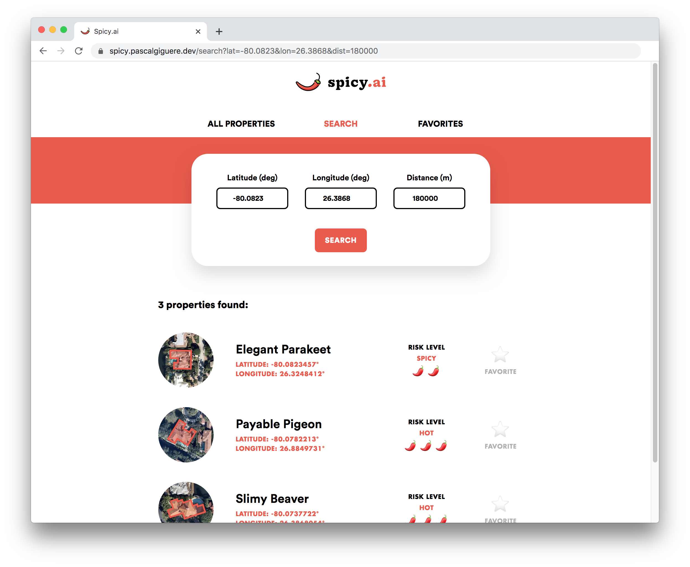

# Spicy.ai - Full Stack

#### 🌶 Live demo: [https://spicy.pascalgiguere.dev]()



This project is a fork of the [Zesty.ai engineering test](https://github.com/zestyai/engineering-test).
It's a modified version of the [`backend-test` branch](https://github.com/pascal-giguere/spicy.ai/tree/backend-test)
that incorporates features from the
[Zesty.ai full-stack engineering test](https://github.com/zestyai/engineering-test-fs).

The back-end test assignment instructions can be found in [backend-assignment.md](backend-assignment.md).
The full-stack test assignment instructions can be found in [fullstack-assignment.md](fullstack-assignment.md).

The README of the back-end test can be found in [backend-test.md](backend-test.md).

## Implemented features (back-end)

See the features previously implemented as part of the `backend-test` branch in [backend-test.md](backend-test.md).

## Implemented features (front-end)

- Search
  - `/search`
- Save for Later
  - `/favorites`
  - Implemented using local storage (no user authentication)
- Freestyle
  - Display all properties
    - `/`
  - Display fake property names and risk levels
    - Pseudo-random, deterministic formulas based on property ID, so that the name and risk level are always the same
      for a given property
  - Cool logo
    - Why not?

## Setup

A single Express app is used to serve both the API and the static front-end files.
As such, a single Docker image is used for both the back-end and front-end.

You can start Spicy.ai using either of these three methods:

#### 1. Build and run locally (with Docker)

This project requires Docker and docker-compose to be installed.

From the project root directory:

```bash
PORT=3031 docker-compose up
```

_**Note**: This project requires a lot of memory to build. If you get a "Heap out of memory" error at build time, you
may need to increase your max Docker memory from 2 GB to 4 GB in your Docker settings._

#### 2. Build and run locally (without Docker)

This project requires Node 12, Yarn 1, PostgreSQL 9 and PostGIS 2 to be installed.

Once the database has been initialized and is running, start the API from the project root directory:

```bash
export PORT=3031
export DATABASE_URL=postgres://postgres@localhost:5432/zesty
yarn
cd backend/ && yarn start
```

#### 3. Run a pre-built Docker image

A prebuilt Docker image of the Spicy.ai API is available in this repo's
[GitHub Packages](https://github.com/pascal-giguere/spicy.ai/packages).

```bash
# If not already done, login to GitHub with your username and a personal access token
docker login docker.pkg.github.com --username <your_username>
docker pull docker.pkg.github.com/pascal-giguere/spicy.ai/spicy-ai-fullstack:2.0.0
```

Two environment variables must be set prior to running the API:

```bash
export DATABASE_URL=postgres://postgres@localhost:5432/zesty
export PORT=3030
```

Once the database has been initialized and is running with the config specified in the env var above, start the API's
Docker image:

```bash
docker run -e DATABASE_URL -e PORT -p 3031:3030 docker.pkg.github.com/pascal-giguere/spicy.ai/spicy-ai-fullstack:2.0.0
```

## Usage

Once the API and database are running, you'll be able to access Spicy.ai from your host machine on the port defined
above:

```bash
curl http://localhost:3031/api
# -> "Spicy.ai API"

curl http://localhost:3031/
# -> <front-end index.html>
```
